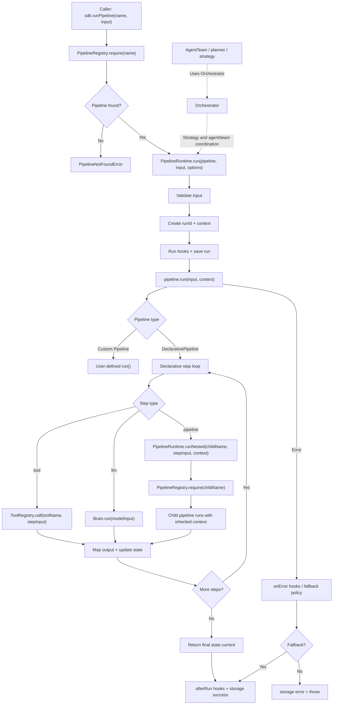

# Architecture

`agent-sdk` is a generic automation runtime. It ships reusable primitives for model execution, agent work, workflow orchestration, tools, memory, storage, auth, transport, MCP, and RAG. It does not ship first-class app-specific automation pipelines.

## Runtime Primitives

- `Brain` / `BrainNode`: provider routing, BYOK resolution, model calls, tool loop execution, usage accounting, and structured object generation.
- `Agent`: instructions, model selection, tools, metadata, session memory, MCP tool attachment, and `asTool()` for composing agents into larger workflows.
- `AgentTeam`: sequential, parallel, manager, and router multi-agent blocks. Teams can also be registered as tools with `asTool()`.
- `DeclarativePipeline`: config-driven workflow engine with `tool`, `llm`, and nested `pipeline` steps, plus mapping, conditions, retries, timeouts, fallbacks, and lifecycle events.
- `PipelineRegistry`: named pipeline registration, lookup, aliasing, listing, and missing-pipeline errors.
- `PipelineRuntime`: pipeline execution lifecycle, run ids, hooks, storage updates, execution mode, nested pipeline runs, and error policy.
- `Orchestrator`: higher-level coordination facade for strategies, agents, and teams. It composes `PipelineRegistry` and `PipelineRuntime` instead of owning declarative pipeline internals.
- `ToolRegistry`: local, transport-backed, and MCP-loaded tools behind one connector contract.
- `memory`, `storage`, `auth`, `transport`, and `rag`: framework-neutral primitives that host apps can wire to their own infrastructure.

## Composition Model

Workflows should be assembled from the generic pieces:

```ts
const tools = new ToolRegistry();
tools.register(searchTool);
tools.register(agent.asTool());
tools.register(team.asTool());
const registry = new PipelineRegistry();
const runtime = new PipelineRuntime({ registry, storage });

const pipeline = new DeclarativePipeline(
  {
    name: "research-workflow",
    steps: [
      { id: "search", type: "tool", name: "search" },
      { id: "judge", type: "tool", name: "judge_agent" },
      { id: "summarize", type: "llm", model: "gpt-4o-mini" },
    ],
  },
  { brain, tools, registry, runtime },
);
```

Agents and teams are composed into declarative workflows by registering their `asTool()` connector. This keeps the pipeline step model small while allowing host apps to plug in any reusable automation block.

## Pipeline Workflow



## App-Specific Automations

App-specific automations such as email handling, scraping model launches, or onboarding APIs should be implemented as `DeclarativePipeline` configs in the host app or copied from `examples/`. They are not SDK core abstractions.

Examples:

- `examples/email-automation.pipeline.ts`
- `examples/scrape-models.pipeline.ts`
- `examples/onboarding-api.pipeline.ts`
- `examples/agent-team-workflow.pipeline.ts`

## Dependency Injection

The SDK core avoids hard dependencies on app routes, Prisma models, hosted queues, or specific providers. Constructors receive SDK interfaces:

```ts
new Brain({ providers, storage, tools, keyResolver });
new Agent({ name, instructions, model }, { brain, tools, memory });
new DeclarativePipeline(config, { brain, tools, registry, runtime });
new AgentSDK({ storage, transport });
```

This keeps production concerns replaceable while preserving a small, framework-neutral runtime surface.

## Execution Modes

The pipeline runtime accepts `sync`, `async`, and `streaming` modes through `PipelineContext`, and the orchestrator forwards those modes when it coordinates higher-level strategy runs. Queue-backed async execution is implemented by plugging in a transport or worker that calls `runPipeline`; the core runtime remains transport-neutral.

## Plugin Marketplace Guidelines

Plugins should register providers, tools, transports, triggers, auth providers, pipelines, storage adapters, or RAG primitives through SDK interfaces.

Marketplace validation should require:

- Manifest with name, version, capabilities, runtime compatibility, and secret requirements.
- No direct dependency on app-specific Prisma models or framework routes.
- Capability tests for every connector.
- Explicit permissions for network, filesystem, secrets, and background execution.
- Semver and compatibility metadata for SDK core versions.
